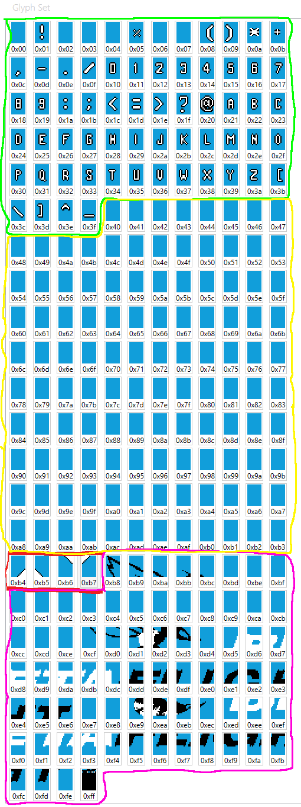

# RFC#0001 - Proposal for a MAX7456 font specification for use with flight controllers

## Purpose

Betaflight (and other Baseflight forks) use the MAX7456 chip to provide OSD functionality. This chip only has the capability to store 256 different glyphs (characters) in its memory. This RFC is a proposal for how we can add versioning metadata to the font to allow the best use of those 256 glyphs - and to allow the choice of for example bigger boot (splash) logo - or more detailed artificial horizon and battery bars.

## MAX7456 Background

The character memory on the MAX7456 chip is capable of storing 256 characters, each of which is 12x18 pixels. Each character requires 54 bytes of storage, but for ease of addressing this is expanded to 64 bytes leaving 10 bytes of unused space. Unused bytes are defaulted to `0x55`. Fonts can be saved\loaded from .mcm files which are just text files consisting of a header line of 'MAX7456' followed by a bit dump of the character memory.

Characters in positions `0x00` and `0xFF` have special uses:

- `0x00` Is used to blank the screen on video initialization.
- `0xFF` Is a byte used to terminate auto-increment mode when writing to the display memory - meaning this character can only be used in single character mode.

## Metadata storage

To allow the firmware to determine the "capabilities" of the font installed it is proposed to store metadata in the font. It is proposed to use the character at position `0xFF` for metadata as excluding this character from use will avoid issues with code using the auto-increment display write mode. Also in the currently used BF fonts this character is completely transparent meaning all bytes are set to `0x55`. The proposed layout of the 64 bytes for this "Info Character" is listed below - the first five bytes are version information and shouldn't change between specification versions, the following bytes are helper information that may vary by specification version.

- Byte 1 - Info Character identifier
- Byte 2 - Font Metadata Version
- Byte 3 - Firmware Type Identifier
- Byte 4 - Firmware Font Version
- Byte 5 - Font ID
- Byte 6 - ASCII Space Offset
- Byte 7 - Symbol Space Offset
- Byte 8 - Pilot Logo Space Offset
- Byte 9 - Boot Logo Space Offset
- Bytes 10 - 63 Reserved for future use - set to `0x00`
- Byte 64 - CRC or Checksum byte

### Info Character ID

This is to help identify this character as a version character - as the current fonts have this byte as `0x55` it is proposed to set this to `0xFF`. It is not possible to solely rely on this Byte to identify this a character block, as although unlikely, it is possible that a font with a user logo may have this byte set to `0xFF`

### Font Metadata Version

Specifies the layout of the rest of the metadata within the "Info Character" i.e bytes 3-64. For Version 1 `0x01` this will be as specified above:

- Byte 4 - Firmware Font Version
- Byte 5 - Font ID
- Byte 6 - ASCII Space Offset
- Byte 7 - Symbol Space Offset
- Byte 8 - Pilot Logo Space Offset
- Byte 9 - Boot Logo Space Offset
- Bytes 10 - 63 Reserved for future use - set to `0x00`
- Byte 64 - CRC or Checksum byte

### Firmware Type Identifier

Determines the class of firmware that this font will work with as iNav and Betaflight have different OSD display functions requiring different symbols. A part example would be:

- `0x01` - Font is designed to work with Betaflight / Cleanflight
- `0x02` - Font is designed to work with iNav

This wil also determine the order and size of the symbol "blocks" within the character memory or font file. For example:

| Memory Location | Symbol Block |
| --------------- | --------------------------------------------------------- |
|`0x00`           | System Reserved - Blank Character                         |
|`0x01 - 0x3F`    | ASCII Standard (0-9, A-Z, + some characters such as ?#%)  |
|`0x40 - 0xB4`    | OSD Symbol Space                                          |
|`0xB4 - 0xB7`    | Pilot Logo (2x2)                                          |
|`0xB8 - 0xFE`    | Boot (Splash) Logo (4x24)                                 |
|`0xFF`           | System Reserved - Info Character                          |

Example font block layout:



### Firmware Font Version

The version of the Font. This should not be changed if style changes are made to the font, but is intended to cater for differences like support for more symbols being added by a particular firmware type. A section of a symbol layout example for betaflight is shown below

| Example Glyph                  | Hex  | Dec | Symbol Name                     |
| -------------------------------|------| --- | ------------------------------- |
|  | 0x60 | 096 | SYM_ARROW_SOUTH                 |
|  | 0x61 | 097 | SYM_ARROW_2                     |
|  | 0x62 | 098 | SYM_ARROW_3                     |
|  | 0x63 | 099 | SYM_ARROW_4                     |
|  | 0x64 | 100 | SYM_ARROW_EAST                  |
|  | 0x65 | 101 | SYM_ARROW_6                     |
|  | 0x66 | 102 | SYM_ARROW_7                     |
|  | 0x67 | 103 | SYM_ARROW_8                     |
|  | 0x68 | 104 | SYM_ARROW_NORTH                 |
|  | 0x69 | 105 | SYM_ARROW_10                    |
|  | 0x6A | 106 | SYM_ARROW_11                    |
|  | 0x6B | 107 | SYM_ARROW_12                    |
|  | 0x6C | 108 | SYM_ARROW_WEST                  |
|  | 0x6D | 109 | SYM_ARROW_14                    |
|  | 0x6E | 110 | SYM_ARROW_15                    |
|  | 0x6F | 111 | SYM_ARROW_16                    |

### Font ID

The ID of the font - This is to allow auto loading etc. for system fonts. Custom or user fonts would set this byte to `0x00` to disable this functionality.

- Custom `0x00`
- Default `0x01`
- Bold `0x02`
- Large `0x03`
- Extra Large `0x04`
- Betaflight `0x05`
- Digital `0x06`
- Clarity `0x07`
- Vision `0x08`

### Space Offsets

These are mainly included to help tooling - e.g. the different blocks could be highlighted differently in the editor.

### Checksum

It is proposed to use the DVB S2 CRC8 algorithm which is a robust single byte CRC that already has an implementation within Betaflight.

## Example

This is an example for the vision font for Betaflight.

```C
0x00 0x01 0x01 0x01 0x08 0x01 0x40 0xB2
0xB8 0x00 0x00 0x00 0x00 0x00 0x00 0x00
0x00 0x00 0x00 0x00 0x00 0x00 0x00 0x00
0x00 0x00 0x00 0x00 0x00 0x00 0x00 0x00
0x00 0x00 0x00 0x00 0x00 0x00 0x00 0x00
0x00 0x00 0x00 0x00 0x00 0x00 0x00 0x00
0x00 0x00 0x00 0x00 0x00 0x00 0x00 0x00
0x00 0x00 0x00 0x00 0x00 0x00 0x00 0xC4
```